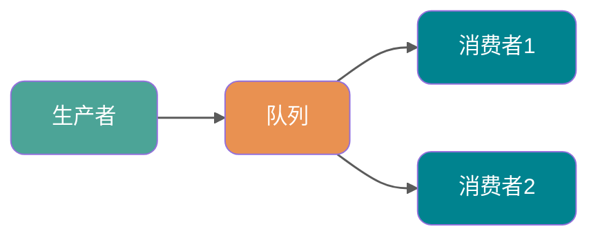
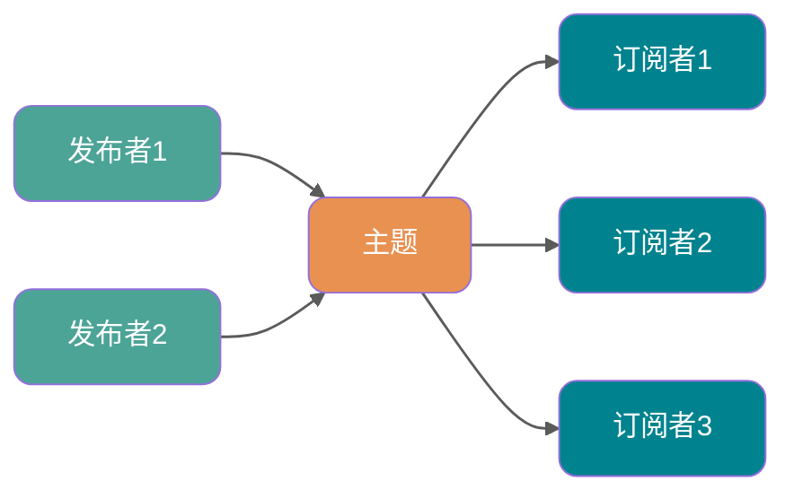
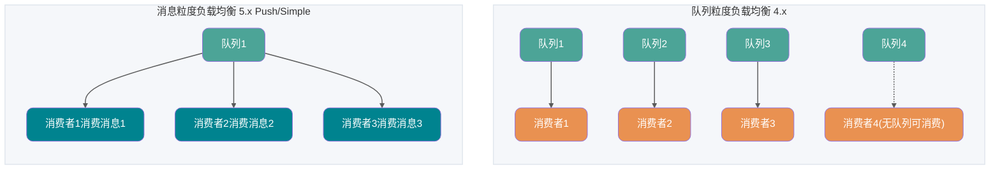

在谈 RocketMQ 的技术架构之前，我们先来了解一下两个名词概念——**队列模型** 和 **主题模型** 。

首先，为什么消息队列叫消息队列？

实际上，早期的消息中间件是通过 **队列** 这一模型来实现的，可能是历史原因，我们都习惯把消息中间件称为消息队列。

但是，如今例如 RocketMQ、Kafka 这些优秀的消息中间件不仅仅是通过一个 **队列** 来实现消息存储的。

### 队列模型

就像我们理解队列一样，消息中间件的队列模型就真的只是一个队列。

队列模型的特点：**一个消息只能被一个消费者消费**。

在一开始我跟你提到了一个 **“广播”** 的概念，也就是说如果我们此时我们需要将一个消息发送给多个消费者(比如此时我需要将信息发送给短信系统和邮件系统)，这个时候单个队列即不能满足需求了。

当然你可以让 Producer 生产消息放入多个队列中，然后每个队列去对应每一个消费者。问题是可以解决，创建多个队列并且复制多份消息是会很影响资源和性能的。而且，这样子就会导致生产者需要知道具体消费者个数然后去复制对应数量的消息队列，这就违背我们消息中间件的 **解耦** 这一原则。

### 主题模型

那么有没有好的方法去解决这一个问题呢？有，那就是 **主题模型** 或者可以称为 **发布订阅模型** 。

> 感兴趣的同学可以去了解一下设计模式里面的观察者模式并且手动实现一下，我相信你会有所收获的。

在主题模型中，消息的生产者称为 **发布者(Publisher)** ，消息的消费者称为 **订阅者(Subscriber)** ，存放消息的容器称为 **主题(Topic)** 。

其中，发布者将消息发送到指定主题中，订阅者需要 **提前订阅主题** 才能接受特定主题的消息。

主题模型的特点：**一个 Topic 可以被多个消费者组订阅，每个消费者组都有独立的消费进度**。在集群消费模式下，同一消费者组内通常只由一个消费者实例处理某条消息；在广播消费模式下，同一消费者组内的每个消费者都会收到消息。

### RocketMQ 中的消息模型

RocketMQ 中的消息模型就是按照 **主题模型** 所实现的。那么 **主题** 到底是怎么实现的呢？

其实对于主题模型的实现来说每个消息中间件的底层设计都是不一样的，就比如 Kafka 中的 **分区** ，RocketMQ 中的 **队列** ，RabbitMQ 中的 Exchange 。我们可以理解为 **主题模型/发布订阅模型** 就是一个标准，那些中间件只不过照着这个标准去实现而已。

所以，RocketMQ 中的 **主题模型** 到底是如何实现的呢？先看一张图：

我们可以看到在整个图中有 `Producer Group`、Topic、`Consumer Group` 三个角色。这个图更接近早期和兼容模型，理解 5.x 时要记住：新版领域模型里生产者本身是轻量、匿名的，生产者组不再是重点概念。

- `Producer Group` 生产者组：在早期客户端和兼容场景中代表某一类生产者，比如我们有多个秒杀系统作为生产者，这多个合在一起就是一个 `Producer Group` 生产者组，它们一般生产相同的消息。
- `Consumer Group` 消费者组：代表某一类的消费者，比如我们有多个短信系统作为消费者，这多个合在一起就是一个 `Consumer Group` 消费者组，它们一般消费相同的消息。
- Topic 主题：代表一类消息，比如订单消息，物流消息等等。

你可以看到图中生产者组中的生产者会向主题发送消息，而 **主题中存在多个队列**，生产者每次生产消息之后会把消息发送到指定主题下的某个队列。

每个主题中都有多个队列(分布在不同的 Broker 中，如果是集群的话，Broker 又分布在不同的服务器中)，集群消费模式下，一个消费者集群多台机器共同消费一个 `topic` 的多个队列。

**负载均衡策略对比**

- **队列粒度负载均衡（4.x 默认策略）**：一个队列只会被一个消费者消费。如果某个消费者挂掉，分组内其它消费者会接替挂掉的消费者继续消费。队列数通常要大于或等于消费者数，消费者少于队列是常见情况，只是单个消费者会分到多个队列；如果消费者数多于队列数，多出来的消费者会空闲。这种模式的缺点是容易产生 **长尾效应**：如果某个消费者处理速度较慢，会导致其对应的队列消息堆积，而其他消费者却处于空闲状态。
- **消息粒度负载均衡（5.x PushConsumer/SimpleConsumer 默认策略）**：RocketMQ 5.x 中，PushConsumer 和 SimpleConsumer 默认使用消息粒度负载均衡，同一消费者分组内的多个消费者可以按照消息粒度分摊主题中的消息；PullConsumer 仍然是队列粒度。消费者获取某条消息后，服务端会将该消息加锁，保证这条消息对其他消费者不可见，直到该消息消费成功或消费超时。这种模式有效解决了长尾效应问题，因为消息不再静态绑定到某个消费者，而是动态分配给空闲的消费者。

消费者个数小于队列个数并不是问题，只是并发能力受消费者数量限制。真正需要避免的是队列数太少，导致后续扩容消费者时没有足够的队列可分配。如下图。

**每个消费组在每个队列上维护一个消费位置** ，为什么呢？

因为我们刚刚画的仅仅是一个消费者组，我们知道在发布订阅模式中一般会涉及到多个消费者组，而每个消费者组在每个队列中的消费位置都是不同的。如果此时有多个消费者组，那么消息被一个消费者组消费完之后是不会删除的(因为其它消费者组也需要呀)，它仅仅是为每个消费者组维护一个 **消费位移(offset)** ，每次消费者组消费完会返回一个成功的响应，然后队列再把维护的消费位移加一，这样就不会出现刚刚消费过的消息再一次被消费了。

可能你还有一个问题，**为什么一个主题中需要维护多个队列** ？

答案是 **提高并发能力** 。的确，每个主题中只存在一个队列也是可行的。你想一下，如果每个主题中只存在一个队列，这个队列中也维护着每个消费者组的消费位置，这样也可以做到 **发布订阅模式** 。如下图。

但是，这样我生产者是不是只能向一个队列发送消息？又因为需要维护消费位置所以一个队列只能对应一个消费者组中的消费者，这样是不是其他的 Consumer 就没有用武之地了？从这两个角度来讲，并发度一下子就小了很多。

所以总结来说，RocketMQ 通过**使用在一个 Topic 中配置多个队列并且每个队列维护每个消费者组的消费位置** 实现了 **主题模式/发布订阅模式** 。
