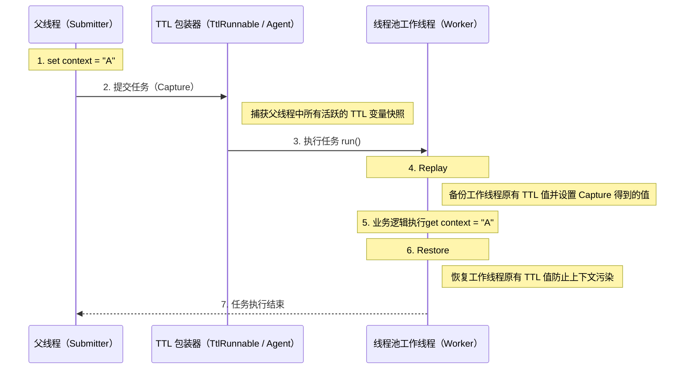

**为什么 ThreadLocal 在异步场景下会失效？**

`ThreadLocal` 的值不在 `ThreadLocal` 对象中，而是存储在 `Thread` 里：

```java
Thread → ThreadLocalMap → Entry(ThreadLocal, value)
```

`ThreadLocal` 数据结构如下图所示：

异步执行往往意味着任务会从当前线程切换到另一个线程（例如线程池中的工作线程）执行。由于不同线程各自维护独立的 `ThreadLocalMap`，默认情况下 `ThreadLocal` 的上下文无法在异步执行中自动传递。

**如何跨线程传递 ThreadLocal 的值？**

为了解决这个问题，业界有两套主流的解决方案，一套是 JDK 原生的，另一套是阿里巴巴开源的。

1. `InheritableThreadLocal`：JDK1.2 提供的一个类，继承自 `ThreadLocal`。使用 `InheritableThreadLocal` 时，会在创建子线程时，令子线程继承父线程中的 `ThreadLocal` 值，但是无法支持线程池场景下的 `ThreadLocal` 值传递。
2. `TransmittableThreadLocal`： `TransmittableThreadLocal`（简称 TTL） 是阿里巴巴开源的工具类，继承并加强了 `InheritableThreadLocal` 类，可以在线程池的场景下支持 `ThreadLocal` 值传递。项目地址：。

#### InheritableThreadLocal 原理

`InheritableThreadLocal` 实现了创建异步线程时，继承父线程 `ThreadLocal` 值的功能。该类是 JDK 团队提供的，通过改造 JDK 源码包中的 `Thread` 类来实现创建线程时，`ThreadLocal` 值的传递。

**`InheritableThreadLocal` 的值存储在哪里？**

在 `Thread` 类中添加了一个新的 `ThreadLocalMap`，命名为 `inheritableThreadLocals`，该变量用于存储需要跨线程传递的 `ThreadLocal` 值。如下：

```JAVA
class Thread implements Runnable {
    ThreadLocal.ThreadLocalMap threadLocals = null;
    ThreadLocal.ThreadLocalMap inheritableThreadLocals = null;
}
```

**如何完成 `ThreadLocal` 值的传递？**

通过改造 `Thread` 类的构造方法来实现，在创建 `Thread` 线程时，拿到父线程的 `inheritableThreadLocals` 变量赋值给子线程即可。相关代码如下：

```JAVA
// Thread 的构造方法会调用 init() 方法
private void init(/* ... */) {
	// 1、获取父线程
    Thread parent = currentThread();
    // 2、将父线程的 inheritableThreadLocals 赋值给子线程
    if (inheritThreadLocals && parent.inheritableThreadLocals != null)
        this.inheritableThreadLocals =
        	ThreadLocal.createInheritedMap(parent.inheritableThreadLocals);
}
```

**`InheritableThreadLocal` 的方案有什么问题？**

这个方案的缺陷在于它的**一次性**，也就是它只在线程创建时发生一次复制。然而，现在的开发中，我们会大量使用线程池，但线程池里的线程是被复用的。

想象一下，任务 A 在线程 1 中执行，把它的 `ThreadLocal` 值传给了线程池里的子线程 2。任务 A 结束后，线程 1 去休息了。接着，任务 B 来了，它在线程 3 中执行，线程池又复用了刚才那个子线程 2 来执行任务 B 的一部分。此时，子线程 2 的 `ThreadLocal` 里还残留着任务 A 传给它的脏数据，而任务 B（在线程 3 里）的上下文却完全没有传递过来。这就导致了数据污染和上下文丢失。

#### TransmittableThreadLocal 原理

JDK 默认没有支持线程池场景下 `ThreadLocal` 值传递的功能，因此阿里巴巴开源了一套工具 `TransmittableThreadLocal` 来实现该功能。

由于阿里巴巴无法改动 JDK 源码，TTL 巧妙地利用了**装饰器模式**对任务（`Runnable`/`Callable`）或线程池（`Executor`）进行增强，将上下文的传递时机从“线程创建时”延迟到了“任务提交与执行时”。

TTL 的核心逻辑可以概括为三个阶段（CRR）：

- **Capture（捕获）**：在提交任务（如调用 `execute`）的一瞬间，`TtlRunnable` 会调用 `TransmittableThreadLocal.Transmitter.capture()`。它通过内部维护的 `holder` 集合，抓取当前父线程中所有活跃的 TTL 变量并存入快照。
- **Replay（回放）**：在线程池的工作线程执行 `run()` 方法前，调用 `replay()`。它将快照中的值 `set` 到当前工作线程中，并备份该线程原有的旧值。
- **Restore（恢复）**：任务执行结束后，调用 `restore()`。它根据备份将工作线程恢复到执行前的状态，防止上下文污染或内存泄漏。

这张图是 TTL 官方提供的 CRR 整个过程的时序图：

不太好理解吧？可以看下我绘制的这张 CRR 时序图，更清晰直观一些：



也就是说，TTL 的本质是在任务提交时 Capture 上下文，在任务执行前 Replay 上下文，在任务结束后 Restore 线程状态，从而安全地支持线程池中的 `ThreadLocal` 传递。

TTL 提供了两种主要的接入方式，可根据侵入性要求和改造成本进行选择。

**1. 显式包装（手动接入）**

使用 `TtlRunnable.get(Runnable)` 或 `TtlCallable.get(Callable)` 对任务进行包装，使用 `TtlExecutors.getTtlExecutor(Executor)`、`getTtlExecutorService(...)` 对线程池进行包装。这种接入方式清晰可控，但需要业务代码配合，存在一定侵入性。

下面这段代码展示了 TTL 通过 CRR，在支持线程池复用和拒绝策略的前提下，安全地传递并隔离 `ThreadLocal` 上下文。

```java
public class TtlContextHolder {
    private static final Logger log = LoggerFactory.getLogger(TtlContextHolder.class);

    // 1. 使用 static final 确保 TTL 实例不被重复创建，防止内存泄漏
    // 重写 copy 方法（可选）：如果是引用类型，建议实现深拷贝
    private static final TransmittableThreadLocal CONTEXT = new TransmittableThreadLocal() {
        @Override
        public String copy(String parentValue) {
            // 默认是直接返回引用，如果是可变对象（如 Map），请在这里 new 新对象
            return parentValue;
        }
    };

    // 2. 线程池初始化：确保只被 TtlExecutors 包装一次
    private static final ExecutorService TTL_EXECUTOR_SERVICE;

    static {
        ExecutorService rawExecutor = new ThreadPoolExecutor(
                2, 4, 60L, TimeUnit.SECONDS,
                new LinkedBlockingQueue<>(1000), (Runnable r) -> new Thread(r, "ttl-worker-" + r.hashCode()),
                new ThreadPoolExecutor.CallerRunsPolicy() // 关键：TTL 完美支持此拒绝策略
        );
        // 包装原始线程池
        TTL_EXECUTOR_SERVICE = TtlExecutors.getTtlExecutorService(rawExecutor);
    }

    public static void main(String[] args) throws Exception {
        try {
            // 3. 在父线程中设置上下文
            CONTEXT.set("value-set-in-parent");
            log.info("父线程上下文: {}", CONTEXT.get());

            // 4. 使用 Lambda 简化任务提交
            TTL_EXECUTOR_SERVICE.execute(() -> {
                log.info("异步任务(Runnable)读取上下文: {}", CONTEXT.get());
                // 模拟业务逻辑
                // 注意：子线程修改是否影响父线程，取决于 copy() 是否做了深拷贝
                CONTEXT.set("value-modified-in-child");
            });

            Future future = TTL_EXECUTOR_SERVICE.submit(() -> {
                log.info("异步任务(Callable)读取上下文: {}", CONTEXT.get());
                return "Success";
            });

            future.get();

            // 5. 验证父线程上下文是否被污染
            log.info("父线程最终上下文: {}", CONTEXT.get());

        } finally {
            // 6. 清理当前线程（父线程）的上下文，子线程的上下文由 TTL 的 Restore 机制自动恢复
            CONTEXT.remove();
        }
    }
}
```

输出：

```ba
09:06:31.438 INFO  [main] TtlContextHolder - 父线程上下文: value-set-in-parent
09:06:31.452 INFO  [ttl-worker-1663166483] TtlContextHolder - 异步任务(Runnable)读取上下文: value-set-in-parent
09:06:31.453 INFO  [ttl-worker-841283083] TtlContextHolder - 异步任务(Callable)读取上下文: value-set-in-parent
09:06:31.453 INFO  [main] TtlContextHolder - 父线程最终上下文: value-set-in-parent
```

如果你想要测试这段代码，记得引入 TTL 的 Maven 依赖；

```XML

    com.alibaba
    transmittable-thread-local
    2.14.4

```

**2. 无侵入接入（Java Agent）**

通过 Java Agent 在类加载阶段对线程池相关类进行 字节码增强，自动织入 TTL 的上下文传递逻辑，实现业务代码零改造的上下文透传。这种方式业务代码无需感知 TTL 的存在，但实现复杂度相对较高。

TTL Agent 默认修饰了以下 JDK 执行器组件：

1. **标准线程池**：`java.util.concurrent.ThreadPoolExecutor` 和 `java.util.concurrent.ScheduledThreadPoolExecutor`。
2. **ForkJoin 体系**：`java.util.concurrent.ForkJoinTask`（从而透明支持了 `CompletableFuture` 和 Java 8 并行流 `Stream`）。
3. **遗留组件**：`java.util.TimerTask`（自 v2.7.0 起支持，v2.11.2 起默认开启）。

在 Java 启动参数中加入 `-javaagent` 配置：

```bash
# 基础配置
java -javaagent:path/to/transmittable-thread-local-2.x.y.jar \
     -cp classes \
     com.your.app.Main
```

#### 应用场景

1. **压测流量标记**： 在压测场景中，使用 `ThreadLocal` 存储压测标记，用于区分压测流量和真实流量。如果标记丢失，可能导致压测流量被错误地当成线上流量处理。
2. **上下文传递**：在分布式系统中，传递链路追踪信息（如 Trace ID）或用户上下文信息。

#### 总结

`ThreadLocal` 的值默认是无法跨线程传递的，因为它的值是存在**每个 `Thread` 对象自己**的 `ThreadLocalMap` 里的，父子线程是两个不同的对象。

为了解决这个问题，主要有两种方案：

1. **JDK 的 InheritableThreadLocal**：它会在**创建子线程**的时候，把父线程的值**复制**一份给子线程。但它的问题是，在**线程池**场景下会失效。因为线程池会**复用**线程，这会导致线程拿到的可能是上一个任务传下来的**脏数据**。
2. **阿里的 TransmittableThreadLocal (TTL)**：这是我们项目里用的方案，它专门解决线程池的问题。它的原理是，在**提交任务**到线程池时，它会把父线程的 `ThreadLocal` 值**捕获**下来，和任务**绑定**在一起。等线程池里的某个线程要执行这个任务时，它再把捕获的值**设置**到这个线程上，任务执行完再**清理**掉。

简单说，**InheritableThreadLocal 是跟线程绑定的，只在创建时有效；而 TTL 是跟任务绑定的，完美支持线程池。**
